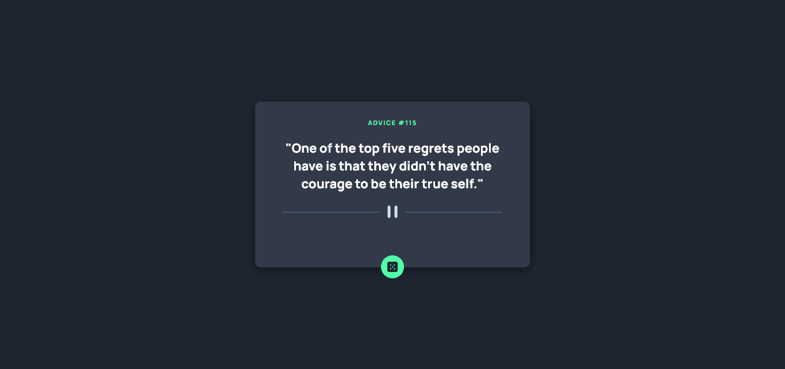

# Frontend Mentor - Advice generator app solution

This is a solution to the [Advice generator app challenge on Frontend Mentor](https://www.frontendmentor.io/challenges/advice-generator-app-QdUG-13db). Frontend Mentor challenges help you improve your coding skills by building realistic projects.

## Table of contents

- [Overview](#overview)
  - [The challenge](#the-challenge)
  - [Screenshot](#screenshot)
  - [Links](#links)
- [My process](#my-process)
  - [Built with](#built-with)
  - [What I learned](#what-i-learned)
  - [Continued development](#continued-development)
  - [Useful resources](#useful-resources)
- [Author](#author)

## Overview

### The challenge

Users should be able to:

- View the optimal layout for the app depending on their device's screen size
- See hover states for all interactive elements on the page
- Generate a new piece of advice by clicking the dice icon

### Screenshot




### Links

- Solution URL: [Odo Peter Github](https://github.com/Odo-Peter/advice-generator)
- Live Site URL: [Odo Peter Vercel.app](https://advice-generator-tau-nine.vercel.app/)

## My process

### Built with

- Semantic HTML5 markup
- CSS custom properties
- Flexbox
- Vanilla Javascript

### What I learned

This challenge has taught me the importance of a proper markup and the power of CSS, alongside media queries, also, in the cause of the challenge, learning to work with an API again, feels awesome (by API, I meant importing the google fonts from google api and using it in the challenge).

The challenge has also added to my knowledge, in terms of using markdown files and in committing a file to github, basically working with the command line has improved some more, all thanks to frontend mentor's challenge. Furthermore, working on toggling the navigation menu button.

I also learnt how to fetch data from an API using the Javascript async method, below is the code of the fetch method.

```js
fetch(QUOTES_URL)
  .then((res) => res.json())
  .then((data) => {
    quotes.textContent = `"${data.slip.advice}"`;
    quoteNumber.textContent = data.slip.id;
  });
```

### Continued development

In future projects or challenges, I'ld love to add a javascript function that changes the modes' of the page, say a light mode and a dark mode.

### Useful resources

- [Free code camp](https://www.freecodecamp.org) - This site personally has improved my coding skills from 0 to a reasonable figure, lol, I'll recommend any person new to programming and coding to check free code camp for FREE. Ensure to be kind enough to give a little donation to help them to continue giving out value.
- [Tech Twitter](https://www.twitter.com) - Tech twitter has helped with several links to quality resources, articles, podcasts, videos, etc, that has helped to improve my coding skills and thus helping me complete this challenge.
- [W3schools](https://www.w3schools.com) - Awesome and coincise documentations.

## Author

- Twitter - [@Odo_Peter_Ebere](https://www.twitter.com/iCode_X)
- Frontend Mentor - [@Odo-Peter](https://www.frontendmentor.io/profile/Odo-Peter)
